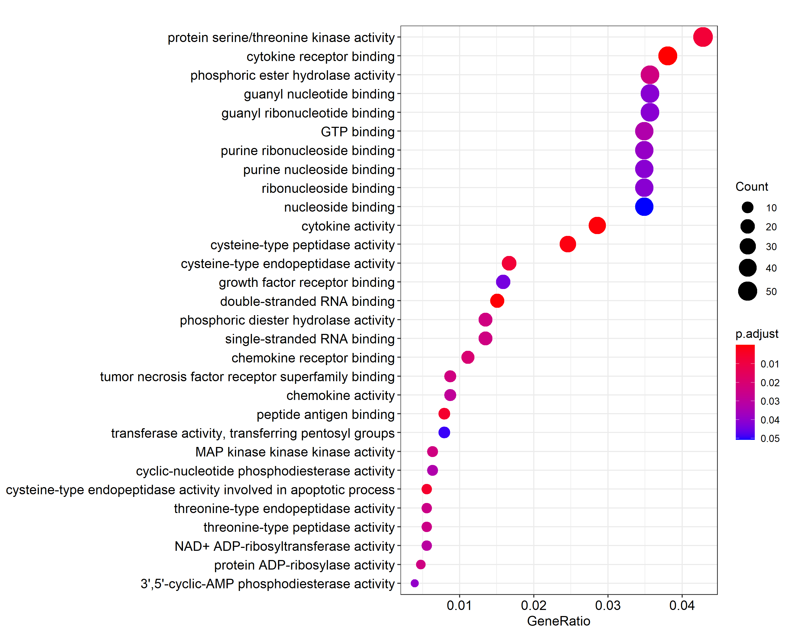

```{r setup, include=FALSE}
knitr::opts_chunk$set(echo = T)
```

\newpage

# 1. Abstract

En este estudio se identifican los genes responsables del efecto proviral de la sobrexpresión de la proteína p53 inducida por la infección del virus influenza humano (IAV). Los datos se obtienen con microarrays de transcriptoma humano que se utilizan para analizar una línea celular humana con o sin un knock-out de p53 e infectadas con IAV o no. Los datos se analizan antes y después de normalizar por RMA, y se filtran. Para identificar los genes expresados diferencialmente se utiliza un modelo lineal y se comparan cuatro grupos para estudiar los efectos de interés.

Los datos y *scripts* utilizados para el análisis pueden encontrarse en un repositorio `GitHub`, acesible aquí: [https://github.com/marcexpositg/exposit_marc_ADO_PEC1_MBio](https://github.com/marcexpositg/exposit_marc_ADO_PEC1_MBio)

# 2. Objetivos

**El estudio:** el objetivo del estudio es estudiar el mecanismo por el qué la sobrexpresión de la proteína p53 producida por la infección del virus influenza humano (human influenza virus, IAV) tiene efectos provirales. Mientras que la mayoría de virus reducen la expresión de p53 para reducir la respuesta antiviral del húesped, la infección con IAV activa la expresión de p53. Por esto, estudiar el mecanismo por el que p53 tiene efectos provirales para IAV podría dar nuevas pistas sobre la interacción entre el virus IAV y el húesped humano para mejorar su tratamiento.

**El experimento:** el experimento se realiza en una línea celular humana de carcinoma de pulmón, A549 (CCL-185), comparando un genotipo natural (wild type, WT) y un genotipo deficiente del gen p53 (knock out KO-3). Ambos se infectaron con IAV (cepa A/Puerto Rico/8/1934 H1N1) o un control sin infectar (mock). 24h después de la infección, se extrajo el RNA y después de la preparación se hibridiza con Affymetrix Human Transcriptome 2.0 Array. El tamaño de la muestra es de 12 muestras, tres réplicas para cada grupo.

**La pregunta a responder:** identificar el mecanismo activado por la sobrexpresión de p53 producida por la infección de IAV, a través de la comparación entre células defectivas de p53 A549-KO-3 y normales A549-WT, infectadas con IAV y no infectadas (mock). 

**Los datos:** los datos del estudio se obtienen de NCBI Gene Expression Omnibus (GEO), acesible a partir del número de aceso GSE106279. El estudio en cuestión también está disponible en acceso abierto [@wang2018influenza].


**Los datos y scripts utilizados para el análisis pueden encontrarse en un repositorio `GitHub`, acesible aquí: [https://github.com/marcexpositg/exposit_marc_ADO_PEC1_MBio](https://github.com/marcexpositg/exposit_marc_ADO_PEC1_MBio)**


\newpage

# 3. Materiales y Métodos

## 3.1. Descripción de los datos

Los datos se obtienen de un estudio previo [@wang2018influenza], publicado en Gene Expression Omnibus (GEO) con número de aceso **GSE106279**. Como los datos provienen de un experimento de microarrays de un solo color de la marca Affymetrix, se obtienen en formato `.CEL`.

En este estudio se utiliza una línea celular humana A549 y esa misma línea pero con el gen p53 desactivado con CRISPR-Cas9 (A549-KO3). Se compara el perfil de expresion de estos dos tipos celulares según si han sido infectadas con IAV o no infectadas (mock). El RNA total se recoje 24h después de la infección y se prepara para en análisis.

El análisis del perfil transcripcional se realiza en un microarray con células para estudiar el transcriptoma humano, en concreto la plataforma **GPL17586** que es el Affymetrix Human Transcriptome Array 2.0 (transcript (gene) version).

Por lo tanto, se trata de un estudio con un diseño factorial completo $2^2$ de tres replicas para cada grupo, con dos factores (estado del gen p53 y infección con IAV) y dos niveles cada uno (natural (wild type,WT) o desactivado (knock out, KO), para el estado del gen p53; y células infectadas con IAV o no infectadas (mock)). Así pues, el total de muestras es de 12.


## 3.2. Pipeline de análisis

Brevemente, los datos en bruto (*raw data*) se han importado a partir de ficheros `.CEL`. Una vez cargados, se ha realizado un análisis descriptivo de los datos en bruto, para ver la distribución de intensidades de cada sonda y compararla entre muestras. Para eliminar la varianza técnica y debida a error experimental, se han normalizado los datos utilizando `RMA`. La distribución de los datos normalizados se ha comprobado para asegurar la correcta normalización de los datos. Los datos normalizados se han sometido a un proceso de filtraje para reducir el error de tipo 1 que podría darse al realizar los contrastes.

Con los datos preparados para la interpretación de resultados, se ha empezado por el ajuste de un modelo líneal para microarrays utilizando `limma`. Para ello, se han definido cuatro grupos a estudiar, recreando los contrastes realizados por el estudio de referencia [@wang2018influenza]:efecto de la infección por IAV en cepa KO, efecto de la infección por IAV en cepa WT, efecto del KO en celulas no infectadas, y efecto del KO en celulas infectadas. Con el modelo lineal se ha identificado los genes expresados diferencialmente entre cada una de las condiciones mencionadas anteriormente. A continuación, se han anotado las identidades utilizando los IDs de Enterez, creado tablas con los genes cuya expresión es más diferente, y representado en volcano plots para visualizar los genes con un menor p-valor (los que tienen más "significancia").

Para entender bien la cuestión del estudio, se han comparado las comparaciones entre ellas. Esto permite la identificación de aquellos genes cuya expresión cambia en todas las muestras, que se corresponden a aquellos que probablemente tienen más relación con el experimento propuesto y explican la variación entre los $2^2$ niveles del estudio. Para esto, se han utilizado diagramas de Venn y *Heatmaps*.

Finalmente, utilizando los genes que se hallan diferencialmente expresados en uno de los grupos anteriores, se han anotado los términos GO relacionados y las vías metabolicas en las que están implicados. Este análisis permite dotar de sentido biológico al análisis realizado con los microarrays y diferencias entre grupos, lo que puede dar pistas para resolver la questión planteada.

## 3.3. Preparación de los datos

Los datos se han descargado de la base de datos GEO con número de aceso **GSE106279** y descomprimido en una carpeta `./data`. Para importarlos a `R`, se ha creado manualmente un fichero `.csv` con la información de cada muestra disponible en GEO para que se interprete a qué grupo pertenece cada muestra, y se ha utilizado la librería `oligo`.

A continuación se ha utilizado `arrayQualityMetrix` con los datos en bruto como *input* para que generara una multitud de gráficos que describan la distribución de los valores de intensidad de cada sonda para cada muestra. Además, se ha implentado una función para representar un análisis de componentes principales de forma y construido un diagrama de cajas con colores para identificar a cada grupo y muestra.

Los datos se han normalizado utilizando la función `rma` de la librería `oligo`, y sometido de nuevo a análisis con `arrayQualityMetrix` para comprobar que se hayan normalizado correctamente.

Finalmente, los datos han sido filtrados para eliminar de los datos aquellas sondas cuya variación general en todas las muestras sea baja o no tengan un Enterez ID asignado o este esté repetido. Se ha eliminado los valores inferiores al quartil 75 de los datos. Para el filtraje, se ha utilizado `nsFilter` al cual se ha subministrado los datos normalizados y la lista de anotaciones Enterez para el chip utilizado, es decir, `hta20transcriptcluster` [@hta20transcriptcluster]. La función `nsFilter` retorna un objeto del mismo tipo.

## 3.4. Identificación de los genes expresados diferencialmente

Como los tests t no son la mejor opcion para la comparación de un número elevado de datos, en microarrays es más común utilizar modelos lineales. Así pues, se ha utilizado el paquete `limma` para realizar un ajuste lineal a partir de modelos de Bayes. Previamente, se ha definido una matriz de diseño (Tabla 1) y de contrastes (Tabla 2). En la de diseño se especifica a que grupo pertenece cada muestra, mientras que en la de contrastes se definen los siguientes contrastes:

- IAVvsMock.KO: Efecto de la infección por IAV en cepa KO.
- IAVvsMock.WT: Efecto de la infección por IAV en cepa WT.
- KOvsWT.Mock: Efecto del KO en celulas no infectadas.
- KOvsWT.IAV: Efecto del KO en celulas infectadas.

```{r Tab1, echo=F}
load(file=file.path("results/5.VolcPlot","designMat.Rda"))
load(file=file.path("results/5.VolcPlot","contMatrix.Rda"))
knitr::kable(designMat, caption="Matriz de diseño")
```


```{r Tab2, echo=F}
knitr::kable(cont.matrix, caption="Matriz de contrastes")
```

La función de ajuste del modelo lineal `lmFit` ha ajustado los datos filtrados y normalizados utilizando la matriz de diseño como referencia. A continuación, se realizan los contrastes con el ajuste del modelo lineal y la matriz de contrastes. Finalmente, se emplea el test de Bayes empírico para calcular, entre otros, el logaritmo de ratio de cambio (`logFC`), que indica la diferencia media del nivel de expresión de un gen entre dos grupos; y un p-valor corregido por Benjamini y Hochberg.

A partir del p-valor ajustado se crean las tablas para mostrar los genes cuya expresión es más diferente entre los contrastes realizados. Aún así, para identificar de qué genes se tratan, se utiliza la información del paquete  `hta20transcriptcluster` [@hta20transcriptcluster], que contiene la relación entre las sondas del chip Human Transcriptome Assay 2.0 de Affymetrix utilizado en el estudio y los genes a los que se unen las sondas junto con sus Enterez ID y nombre. Así, las tablas con los genes diferencialmente expresados aportan información de interés dando pista de las funciones de los genes cuya expresión cambia por el efecto estudiado en cada comparación.

Con estos datos anotados, se representan volcano plots para cada uno, utilizando la función `volcanoplot`. Estos gráficos muestran la distribución de los genes de cada contraste según cambia su nivel de variación (`logFC`) y significancia estadística `p-value`.

## 3.5. Comparaciones múltiples

Para estudiar el efecto de la proteina p53 en respuesta a infección por IAV es necesario comparar múltiples grupos entre ellos. Por esto, se utiliza una función `decideTests` con el modelo ajustado de contrastes para selecionar los genes con un cambio de expresión (alto o bajo) significativo en cada comparación.

Estos datos se visualizan con diagramas de Venn utilizando `vennDiagram`, que muestra la intersección de genes que se sobre o bajo regulan entre cada contraste. Se crean tres gráficos para recrear el estudio en cuestión.

Además, estas relaciones se representan en *heatmaps* clusterizados, que permiten ver como los genes diferencialmente expresados forman grupos entre muestras, ya que de este modo se pueden identificar aquellos genes que podrían tener una influencia en la respuesta estudiada.

## 3.6. Análisis de significación biológica.

Para este apartado, solamente se ha utilizado una comparación: el efecto de la infección en una cepa KO para p53. En primer lugar, se han observado los términos GO de los genes expresados diferencialmente. Para ello, se ha obtendio primero una lista de los genes expresados diferencialmente en esta muestra. De esta, se seleccionan aquellos cuyo p-valor ajustado sea menor a 0.15 (por lo tanto, 85% de significación). Nótese que para realizar en análisis biologico interesa encontrar relaciones entre los genes diferencialmente expresados, así que se rebaja el límite de significación para estudiar más genes y observar todo el conjunto de relaciones que las afectan en caso que huviera múltiples. A partir de la lista final se exporta el conjunto de sus EnterezID.

Con esta lista de genes, se utiliza `clusterProfiler` para analizar los términos GO que se encuentran enriquidos en la comparación. Se representa la abundáncia de cada término GO en los genes expresados diferencialmente con un `dotplot`. Además, se utiliza la funcionalidad de `clusterProfiler` para crear un gráfico elaborado de las relaciones de dependencia entre los términos GO identificados como enriquidos.

En segundo lugar, se analizan las vias metabolicas o bioquímicas en las que se encuentran implicados los genes expresados diferencialmente utilizando la base de datos de `ReactomePA`. Previamente a su uso, se crea una relación entre los términos GO (base de datos de función biológica) y su identificador KEGG (base de datos de reacciones metabólicas) para enlazarla con la lista anterior. De aquí se obtienen dos graficos, uno con barras que muestra qué vía es más significativa en cada comparación realizada, y otra con la relación entre los términos GO identificadas y las vias metabólicas en los que están implicados.


\newpage

# 4. Resultados

## 4.1. Preparación de los datos

Inicialmente, no se observa demasiada variación en la distribución de los valores de intensidad de las sondas entre las muestras estudiadas, pese a las distintas condiciones experimentales de cada uno (Figura \ref{fig:Fig1} y Figura \ref{fig:Fig1_2}). En estos graficos puede verse como la mayoria de datos se distribuye cerca de un valor de intensidad concreto aunque haya algunos datos que se alejen mucho de la desviación normal del resto de los datos. Nótese que en la curva de densidad se solapan todas las muestras porqué su distribución es muy parecida, tal y como se ve en el diagrama de cajas.

```{r Fig1, echo=F, out.width="40%",fig.hold='hold', fig.align='center', fig.cap="Diagrama de cajas de la distribución de la intensidad de las sondas de cada muestra de los datos en bruto, coloreadas por grupos."}

```

```{r Fig1_2, echo=F, out.width="40%",fig.hold='hold', fig.align='center', fig.cap="Curva de densidad de la distribución de la intensidad de las sondas para los datos en bruto."}
knitr::include_graphics("results/1.QCRaw/dens.pdf")
```

Utilizando en análisis de componentes principales (PCA), se ve que el 29.7% de la variabilidad se explica con el primer componente (PC1), que separa las muestras según si han sido infectadas con IAV o no (Figura \ref{fig:Fig2}). El segundo componente (PC2), explica el 21.6% de la variabilidad y separa las muestras según la linea celular. Por lo tanto, los dos factores tienen una contribución parecida a la variabilidad de los datos, siendo el factor infectado con IAV / Mock un poco más responsable de la variabilidad que el factor línea celular.

```{r Fig2, echo=F, out.width="50%",fig.hold='hold', fig.align='center', fig.cap="Análisis de componentes principales de los datos en bruto"}

```

En este caso, las diferencias entre la distribución de los valores de intensidad no son muy notables entre distintas muestras. Pese a eso, el proceso de normalización se realiza igualmente para reducir la distancia entre los puntos con valores más extremos y el centro de los datos. Una vez normalizados, los valores siguen una distribución normal y centrada y no hay valores tan extremos que hagan quedar el diagrama de cajas en la parte inferior del gráfico (Figura \ref{fig:Fig3}). Nótese que de nuevo las distintas muestras no se observan en la curva de densidad porqué están solapadas. Como ahora las muestras se encuentran distribuidas igualmente, se concluye que la normalización de los datos es correcta y puede proseguir el análisis.

```{r Fig3, echo=F, out.width="40%",fig.hold='hold', fig.align='center', fig.cap="Diagrama de cajas de la distribución de los datos normalizados, coloreadas por grupos."}

```

```{r Fig3_2, echo=F, out.width="50%",fig.hold='hold', fig.align='center', fig.cap="Curva de densidad de la distribución de la intensidad de las sondas para los datos en bruto"}
knitr::include_graphics("results/3.QCNorm/dens.pdf")
```

Como la diferencia entre los dos componentes era tan inferior, al normalizar los datos la varianza cambia y el factor que explicaba un componente pasa a ser el otro y viceversa. Para los datos normalizados, el primer componente (PC1) explica el 32.7% de la varianza y el segundo componente (PC2) explica el 26.6% de la varianza. A diferencia de los datos en bruto, para los datos normalizados el primer componente divide los datos según línea celular y el segundo componente los divide según si han estado infectados o no (Figura \ref{fig:Fig4}).

```{r Fig4, echo=F, out.width="50%",fig.hold='hold', fig.align='center', fig.cap="Análisis de componentes principales de los datos normalizados"}

```

Para identificar los genes diferencialmente expresados, debe realizarse un alto número de comparaciones que incrementarían el error de tipo 1 del contraste. Una solución para prevenirlo es reducir el número de comparaciones realizadas, lo que se puede conseguir eliminando de los datos aquellos genes que a priori no parece que vayan a ser expresados diferencialmente a través de un proceso de filtraje. Este filtraje asume que los genes cuya varianza global (entre las cuatro muestras) es baja no serán significativos para cuando las muestras se comparen entre ellas. Al observar como se distribuyen los puntos de intensidad ordenados por su varianza, se puede ver que solamente un 1% de los datos tiene una varianza mucho mas alta que el resto (Figura \ref{fig:Fig5}).

```{r Fig5, echo=F, out.width="50%",fig.hold='hold', fig.align='center', fig.cap="Análisis de componentes principales de los datos normalizados"}

```

Por lo tanto, se realiza un filtraje de los datos eliminando todas aquellas sondas cuya varianza esté por debajo el quartil 75 de los datos ordenados por varianza de menor a mayor. Además, se aplica un filtro que elimina las sondas que no tienen un gen anotado en Enterez y se eliminan aquellas cuyo valor de intensidad sea menor que otra sonda que representa el mismo gen.

Al final del proceso de filtraje, se eliminan 6245 sondas por representar genes duplicados (se retiene el que tiene una varianza mayor), 17455 sondas que no superan el minimo de varianza especificada, y 41005 sondas que no tienen un Enterez ID asignado (Tabla 3). Por lo tanto, el conjunto de datos pasa de 70523 features a solamente 5818, lo que reduce mucho el numero de comparaciones a realizar y disminuye el riesgo de error tipo I. 

```{r echo=F}
load(file=file.path("./results/4.Filtered","filtResults.Rda"))
df_table <- as.data.frame(filtered$filter.log)
knitr::kable(df_table,col.names=c("Dupslicados","Baja variación","No EnterezID"),
             caption="Resultado del proceso de filtraje.")
```

Cabe mencionar que el proceso de filtraje no está exempto de crítica, pues que la varianza global sea baja para un punto no necesariamente indica que lo sea para una comparación en concreto. Aún así, ha optado por realizarse para simplificar el análisis.

## 4.2. Identificación de genes diferencialmente expresados

El modelo lineal permite identificar los genes cuya expresión cambia significativamente entre cada uno de los contrastes planteados. Para cada contraste genera una lista de los genes ordenados de menor a mayor p-valor (de más a menos significativo), tal y como se muestra aquí para los 6 genes más significativos del contraste entre infectar o no células Knock-out (Tabla 4).


```{r echo=F}
load(file=file.path("results/5.VolcPlot","topTab_IAVvsMockKO.Rda"))
knitr::kable(topTab_IAVvsMock.KO[1:4,],
             caption="Genes más significativos de IAV vs Mock en KO.")
```

\newpage

Aún así, esta información es poco relevante biologicamente si no se conoce la identidad o función de estos genes. Por esto, se anotan los resultados a partir de los identificadores Enterez ID. A continuación, se muestran las tablas de los 6 genes más significativos para cada contraste realizado (Tablas 5, 6, 7, y 8).


```{r echo=F}
load(file=file.path("results/5.VolcPlot","topAnn_IAVvsMockKO.Rda"))
knitr::kable(topAnn_IAVvsMock.KO[1:5,1:4],
             caption="Genes anotados más significativos de IAV vs Mock en KO")
```


```{r echo=F}
load(file=file.path("results/5.VolcPlot","topAnn_IAVvsMockWT.Rda"))
knitr::kable(topAnn_IAVvsMock.WT[1:5,1:4],caption="Genes anotados más significativos de IAV vs Mock en WT")
```


```{r echo=F}
load(file=file.path("results/5.VolcPlot","topAnn_KOvsWTMock.Rda"))
knitr::kable(topAnn_KOvsWT.Mock[1:5,1:4],caption="Genes anotados más significativos de KO vs WT en Mock")
```


```{r echo=F}
load(file=file.path("results/5.VolcPlot","topAnn_KOvsWTIAV.Rda"))
knitr::kable(topAnn_KOvsWT.IAV[1:5,1:4],caption="Genes anotados más significativos de KO vs WT en IAV infectadas")
```

En los volcano plots pueden verse los nombres de los genes con más cambio a nivel biologico y significancia estadística, que coinciden con los de las tablas anteriores. Se puede ver que estos genes están presentes en todas las muestras como los genes que cambian más de expresión. El estudio de referencia también ha identificado estos genes como los que tienen una expresión más diferencial.

```{r Fig6, echo=F,warning=F,fig.width=8,fig.height=8,fig.show='hold',fig.pos='H',fig.cap="Volcano plots para los contrastos IAVvsMock.KO (superior izquierda), IAVvsMock.WT (superior derecha), KOvsWT.IAV (inferior izquierda), KOvsWT.Mock (inferior derecha). Se muestra el logFC i el -log(p-valor), con línea vertical a abs(logFC)=1"}
library(png);library(raster)
A <-readPNG("results/5.VolcPlot/VP_IAVvsMockKO.png")
B <-readPNG("results/5.VolcPlot/VP_IAVvsMockWT.png")
C <-readPNG("results/5.VolcPlot/VP_KOvsWTIAV.png")
D <-readPNG("results/5.VolcPlot/VP_KOvsWTMock.png")

#set up figure
par(mar=c(0,0,0,0), xpd=NA, mgp=c(0,0,0), 
    oma=c(0,0,0,0), ann=F, mfrow = c(2,2))
plot.new()
usr<-par("usr")

#fill plot with images
rasterImage(A, usr[1], usr[3], usr[2], usr[4])
rasterImage(B, usr[1]+1.1, usr[3], usr[2]+1.1, usr[4])
rasterImage(C, usr[1], usr[3]-1.1, usr[2], usr[4]-1.1)
rasterImage(D, usr[1]+1.1, usr[3]-1.1, usr[2]+1.1, usr[4]-1.1)
```

\newpage

## 4.3. Múltiples comparaciones

Comparar si los genes diferencialmente expresados entre varios tipos de contrastes son los mismos puede dar más información sobre la respuesta biológica de los datos estudiados.

Por ejemplo, la comparación entre el contraste IAV vs Mock en KO o en WT revela que hay 136 genes sobrexpresados y 6 genes bajo expresados en común en esta situación (Figura 9 izquierda). Los genes en común en este diagrama son aquellos que tienen una respuesta a la infección por IAV independientemente de la acción de p53.

La comparación entre el contraste KO vs WT en Mock o IAV indica que hay 91 genes sobreregulados y 35 infraexpresados, que son los que se alteran por la absencia de p53 independientemente de si está infectado o no. Por lo tanto, los genes que se muestran en común en estos diagramas de Venn no se sabe si tienen que ver con la infección y sobrexpresión de p53 a la vez, ya que solo comparan los factores a pares.

```{r Fig7,echo=F,warning=F,fig.width=8,fig.height=4,fig.show='hold',fig.pos='H',fig.cap="Gens en comú entre les comparacions IAVvsMock.KO i IAVvsMock.WT (esquerra) o KOvsWT.Mock i KOvsWT.IAV (dreta) amb FDR<0.1 i logFC>1"}
Z <-readPNG("results/6.MultComp/Venn_G1vsG2.png")
X <-readPNG("results/6.MultComp/Venn_G3vsG4.png")
#set up figure
par(mar=c(0,0,0,0), xpd=NA, mgp=c(0,0,0), 
    oma=c(0,0,0,0), ann=F, mfrow = c(1,2))
plot.new()
usr<-par("usr")
#fill plot with images
rasterImage(Z, usr[1], usr[3], usr[2], usr[4])
rasterImage(X, usr[1]+1.1, usr[3], usr[2]+1.1, usr[4])
```

Para identificar el grupo de genes cuya expresión se regula por p53 al infectar con IAV, deben hacerse las cuatro comparaciones a la vez para neutralizar tantos efectos como sea posible. Al integrar los cuatro grupos, encontramos solamente un gen sobrexpresado en todas las comparaciones (Figura \ref{fig:Fig8}). Este gen no solamente responde a la infección con IAV sino que también es sensible al estado de p53. Por lo tanto, es el responsable de la pregunta que intentamos responder.

```{r Fig8, echo=F, out.width="60%",fig.hold='hold', fig.align='center', fig.cap="Gens en comú entre les quatre comparacions amb FDR<0.1 i logFC>1"}

```

Para ver como se relacionan entre sí los genes comunes entre las muestras y ver si se forman clusters con similitudes, utilizamos un *heatmap* clusterizado. En este *heatmap* se puede ver como las replicas se juntan y siguen un patrón de expresión común (Figura \ref{fig:Fig9}), y también que se agrupan antes las muestras según la distinción Mock vs IAV que por línea celular, lo que concuerda con lo visto con el PCA de los datos normalizados. Comparando los colores y grupos podemos identificar aquellos genes que se sobrexpresan con la infección de IAV y aquellos que dependen del estado de la proteina p53.

```{r Fig9, echo=F, out.width="80%",fig.hold='hold', fig.align='center', fig.cap="Heatmap clusterizado de los genes en común en los cuatro grupos."}

```

## 4.4. Análisis de significación biológica

Para conseguir responder a la cuestión planteada, debemos ver qué sentido biologico tienen los genes que se encuentran expresados diferencialmente, lo que se conoce como el proceso de análisis de significación biológica. Para esto, empezamos relacionando los genes expresados diferencialmente con sus respectivos terminos GO.

Se va a observar los términos GO implicados en la infección utilizando en análisis del contraste IAVvsKO.Mock. Se muestra un ejemplo de los datos utilizados (Tabla 9) para construir el gráfico de puntos que muestra los términos GO significativos (Figura \ref{fig:Fig10}). En este, se puede ver, por ejemplo, que de los 1261 genes expresados diferencialmente en este contraste, hay 48 que están asociados con el término GO:0005126 que corresponde a actividad de unión a las citoquinas. Así, se ve que la infección tiene actividades de unión a factores immunes.

Otra representación útil es la de la red de relaciones en los términos GO (Figura \ref{fig:Fig11}) que muestra las relaciones entre los términos identificados como diferenciales, con lo que se pueden agrupar con términos mayores y podríamos describir que el efecto de este contraste tienen varias actividades catalíticas como peptidasa de cisteinas pero mayoritáriamente tiene actividad de unión tanto a antígenos como a receptores de citoquinas.

```{r echo=F, message=F}
load(file=file.path("results/7.BioSignif","ego_IAVvsMockKO.Rda"))
knitr::kable(as.data.frame(ego_IAVvsMock.KO)[1:5,1:3],
             caption="Terminos GO del contraste IAVvsMock.KO.")
```

```{r Fig10, echo=F, out.width="80%",fig.hold='hold', fig.align='center', fig.cap="Abundancia relativa de los términos GO en los genes expresados diferencialmente en IAVvsMock.KO"}

```

```{r Fig11, echo=F, out.width="80%",fig.hold='hold', fig.align='center', fig.cap="Relaciones entre los términos GO de los genes expresados diferencialmente en IAVvsMock.KO"}

```

Utilizando `ReactomePA` podemos comparar más de una comparación entre ellas, como aquí se hace mezclando los dos primeros contrastes para ver los genes que se expresan a causa de la presencia/absencia de p53. El diagrama de barras (Figura \ref{fig:Fig12}) indica que la actividad más importante de p53 es la de regular la señalización de interleukinas seguida por la respuesta de interferon, es decir, activar el sistema immunitario. Otra representación que puede hacerse es crear una red para mostrar las relaciones entre los genes expresados diferencialmente y los términos GO a los que se asignan (Figura \ref{fig:Fig13}), con lo que vemos que casi todos se asignan a la respuesta de interferon y interleukinas y que en muchos casos comparten las dos funciones. Por lo tanto, esta visualización informa que p53 actua regulando las interleukinas y la respuesta de interferón, con lo que la pregunta original seguramente se podría responder investigando este aspecto más al detalle.

```{r Fig12, echo=F, out.width="80%",fig.hold='hold', fig.align='center', fig.cap="Diagrama de barras de términos GO según el número de genes relacionados con ellos y asociados a la actividad de p53."}
knitr::include_graphics("results/7.BioSignif/ReactomePABarplot.IAVvsMock.KO.pdf")
```

```{r Fig13, echo=F, out.width="80%",fig.hold='hold', fig.align='center', fig.cap="Red the relaciones entre los términos GO más abundantes y los genes expresados diferencialmente según p53."}

```

\newpage

# 5. Discusión

La mayor diferencia entre el análisis de los datos realizado por los autores del estudio y el análisis mostrado aquí es el número de genes mostrado en el diagrama de Venn, es decir, el número de genes que se consideran expresados diferentemente pero en común entre los grupos. Mientras que en el diagrama de los cuatro contrastes tienen 50 en común entre todos los grupos, aqui solamente hay uno. Los autores utilizan más de 1000 genes para los diagramas de Venn, mientras que aquí el valor total es inferior a 1000.

Estas discrepancias podrían debserse al proceso de filtraje. Nótese que en el proceso de filtraje se pierde la gran parte de los datos porqué no se encuentra un Enterez ID correcto para aquella sonda. Esto podría causar una excesiva pérdida de datos que impediera llegar a las mismas conclusiones que en el estudio de referencia, ya que no es lo mismo valorar los 50 genes en común del estudio que solamente uno encontrado aquí. Pate de la razón por la que aquí se eliminan tantos datos es porqué la base de relaciones sondas - Enterez ID está hecha a partir de repositorios públicos y por inferencia, mientras que quizás los autores del estudio utilizan el *software* propietario de la marca productora del chip (affymetrix) que contiene la información completa de los genes a los que cada sonda representa. Por este motivo, pueden trabajar con un *dataset* más informativo que la recreación que se presenta aqui e identificar más genes como responsables.

Otra posible diferencia también está en el proceso de filtraje, y es que si los autores no realizan el filtraje, quizás están augmentando el error de tipo I debido a las comparaciones excesivas entre sondas del microarray, lo que explicaría un número (en este supuesto, incorrectamente) alto de genes en común entre las cuatro condiciones.

Una posible solución sería disminuir el valor de confianza establecido para la significación, ya que cuando se trata de identificar el efecto biologico es más interesante obtener un conjunto de datos y ver sus relaciones para ganar una idea del proceso subyacente que no identificar unos pocos responsables.

Pese a estas diferencias, el análisis de significación biologica ha acabado relacionando el efecto de p53 sobre la infección IAV con genes que también se han identificado como relacionados por el estudio de referencia. Así pues, deberían revisarse algunos procesos como el filtraje pero la orientación del análisis presentado es adecuada.

# 6. Conclusión

El análisis y la recreación del estudio de referencia ha sido posible gracias a las librerías de `R` y paquetes de `Bioconductor`. Los resultados presentados en este informe han encontrado menos genes en común entre los contrastes que en el estudio de referencia. Esto quizás se debe a un excesivo filtraje de los datos causado por la falta de asignaciones correctas entre sondas y Enterez ID, ya que para este chip el comercial no proporciona esta información en un formato válido para `Bioconductor` y debe recurrirse a otro paquete experimental en el que quizás mancan algunos datos. Aún así, el análisis de significación biológica concuerda en algunos puntos con el del estudio de referencia, indicando que la relación entre IAV y p53 pasa por el estímulo de la respuesta de interferon y regulación de las interleukinas.

# 7. Bibliografía

<div id="refs"></div>

\newpage

# 8. Apéndice: Código de R y resultados obtenidos

## 8.1. Preparar el entorno e importar los datos

Para recrear este trabajo será necesario un conjunto de librerías y paquetes, para ello puede utilizarse el script adjunto `InstallPackages.R`.

Para empezar, definimos el directorio de trabajo (que depende para cada usuario) y creamos carpetas para guardar los datos y los resultados producidos del análisis.

```{r warning=F, cache=T}
setwd("C:/Users/Usuario/Documents/0.UOC/AnalisisOmicas/PEC1/exposit_marc_ADO_PEC1")
dir.create("data")
dir.create("results")
```

A continuación, se descargan los datos en formato `.CEL` comprimido des de la base de datos GEO y se descomprime en la carpeta `./data`. Se obtienen tanto los ficheros `.CEL` como `.CHP`. Aquí se van a utilizar los datos `.CEL` ya que los `.CHP` son una versión procesada por software de Affymetrix.

También se crea "manulamente" un fichero `targets.csv` con la información de cada fichero, que se muestra a continuación:


```{r  cache=T}
targets <- read.csv2("./data/targets.csv", header = TRUE, sep = ";") 
knitr::kable(
 targets, booktabs = TRUE,
 caption = 'Content of the targets file used for the current analysis')
```

Para importar los datos de los ficheros `CEL` y trabajar con ellos en `R` se utiliza `read.celfiles`.

```{r warning=F, message=F, cache=T}
library(oligo)
celFiles <- list.celfiles("./data", full.names = TRUE)
library(Biobase)
```


```{r warning=F, cache=T}
my.targets <- read.AnnotatedDataFrame(file.path("./data","targets.csv"), 
                                      header = TRUE, row.names = 1, 
                                      sep=";") 
rawData <- read.celfiles(celFiles, phenoData = my.targets)
```

Para simplificar el tratamiento de los datos, el nombre de los ficheros se cambia por los nombres cortos asignados a cada uno. Así se puede ver que se han cargado los datos correctamente, mostrando los nombres cortos de cada uno.

```{r  cache=T}
rownames(pData(rawData)) <- my.targets@data$ShortName
colnames(rawData) <- rownames(pData(rawData)) 
head(rawData)
```

## 8.2. Control de calidad

Para hacer una primera visualización de los datos se utiliza `arrayQualityMetrics`, y se guardan las figuras producidas en una carpeta dentro de resultados. De ahí se obtienen los gráficos de densidad y de clústers que se muestran en los resultados.

```{r eval=FALSE}
library("arrayQualityMetrics")
arrayQualityMetrics(expressionset = rawData, 
                    outdir = "./results/1.QCRaw", force = F)
```

El gráfico de componentes principales (PCA) generado por `arrayQualityMetrix` no indica a qué muestra corresponde a cada punto, ni ninguna pista sobre los grupos formados por los datos. Por esto, se define la siguiente función:

```{r  cache=T}
library(ggplot2)
library(ggrepel)
plotPCA3 <- function (datos, labels, factor, title, scale,colores,
                      size = 1.5, glineas = 0.25) {
  data <- prcomp(t(datos),scale=scale)
  # plot adjustments
  dataDf <- data.frame(data$x)
  Group <- factor
  loads <- round(data$sdev^2/sum(data$sdev^2)*100,1)
  # main plot
  p1 <- ggplot(dataDf,aes(x=PC1, y=PC2)) + theme_classic() +
    geom_hline(yintercept = 0, color = "gray70") +
    geom_vline(xintercept = 0, color = "gray70") +
    geom_point(aes(color = Group), alpha = 0.55, size = 3) +
    coord_cartesian(xlim = c(min(data$x[,1])-5,max(data$x[,1])+5)) +
    scale_fill_discrete(name = "Group")
  # avoiding labels superposition
  p1 + geom_text_repel(aes(y = PC2 + 0.25, label = labels),
                       segment.size = 0.25, size = size) +
    labs(x = c(paste("PC1",loads[1],"%")),y=c(paste("PC2",loads[2],"%"))) +
    ggtitle(paste("Principal Component Analysis for: ",title,sep=" ")) +
    theme(plot.title = element_text(hjust = 0.5)) +
    scale_color_manual(values=colores)}
```

Esta se utiliza para crear un gráfico más acurado, que es el que se muestra en los resultados.

```{r  cache=T}
png("./results/1.QCRaw/PCA_RawData.png", res = 300,
       width = 5.5, height = 4, units = 'in')
plotPCA3(exprs(rawData), labels = targets$ShortName,
         factor = targets$Group, title="Raw data", scale = FALSE,
         size = 2, colores = c("red", "blue", "green", "yellow"))
dev.off()
```

Lo mismo pasa con el diagrama de cajas, cuya representación es simple en R y puede mejorarse respeto la producida por `arrayQualityMetrix` coloreando las muestras según su condición (las replicas tienen el mismo color entre ellas).

```{r warning=F, message=F,  cache=T}
png("./results/1.QCRaw/BoxPlot_RawData.png",
     res = 300,width = 4.5, height = 4, units = 'in')
boxplot(rawData, cex.axis=0.5, las=2,  which="all",
        col = c(rep("red", 3), rep("blue", 3),
                rep("green", 3), rep("yellow", 3)),
        main="Distribution of raw intensity values")
dev.off()
```

## 8.3. Normalización

De los distintos métodos que se pueden utilizar para hacer la normalización (MAS5, VSN, RMA, GCRMA, etc.), elegimos utilizar Robust Multichip Analysis (RMA). El proceso de normalización reduce al máximo la variabilidad entre las muestras debida a factores técnicos, es decir, la variabilidad introducida al haberse analizado cada muestra con un chip distinto. Esto permite que las muestras puedan compararse entre ellas al hacer que las diferencias en la intensidad de señal sean causa de la expresión diferencial de un gen y no a causa de variabilidad técnica.

Aunque el proceso de normalización conste de 3 pasos (corregir el fondo de la muestra, normalizar para permitir la comparación, y resumir los valores de las distintas sondas de un mismo gen en un solo valor), en `R` puede implementarse con la función `rma`. El marco en el que se ejecuta esta función asegura que se guarda el resultado y si se volviera a ejecutar se cargarían los datos.

```{r  cache=T}
dir.create("results/2.NormData")
normalize <- F #this value is set as True the first time, then it is 
               #false to avoid normalizing every time the script is run
if(normalize){
  eset_rma <- rma(rawData)
  save(eset_rma, file=file.path("./results/2.NormData","data-normalized.Rda"))
  write.csv(exprs(eset_rma), file="./results/2.NormData/NormData.csv")
}else{
  load(file=file.path("./results/2.NormData","data-normalized.Rda"))
}
```

## 8.4. Control de calidad datos normalizados

Para hacer una primera visualización de los datos se utiliza `arrayQualityMetrics`, y se guardan las figuras producidas en una carpeta dentro de resultados. De ahí se obtienen los gráficos de densidad y de clústers que se muestran en los resultados.

```{r  cache=T, eval=F}
arrayQualityMetrics(expressionset = eset_rma,
                    outdir = "./results/3.QCNorm",force = F)
```

Los graficos PCA y de cajas se crean del mismo modo que antes.

```{r  cache=T}
png("./results/3.QCNorm/PCA_NormData.png", res = 300,
       width = 5.5, height = 4, units = 'in')
plotPCA3(exprs(eset_rma), labels = targets$ShortName,
         factor = targets$Group, title="RMAnorm data", scale = FALSE,
         size = 2, colores = c("red", "blue", "green", "yellow"))
dev.off()
```

Lo mismo pasa con el diagrama de cajas, cuya representación es simple en R y puede mejorarse respeto la producida por `arrayQualityMetrix` coloreando las muestras según su condición (las replicas tienen el mismo color entre ellas).

```{r  cache=T}
png("./results/3.QCNorm/BoxPlot_NormData.png",
     res = 300,width = 4.5, height = 4, units = 'in')
boxplot(eset_rma, cex.axis=0.5, las=2,  which="all",
        col = c(rep("red", 3), rep("blue", 3),
                rep("green", 3), rep("yellow", 3)),
        main="Distribution of RMA-normalized intensity values")
dev.off()
```

## 8.5. Filtraje no especifico

En el momento de selecionar los genes expresados diferencialmente, los p-valores pueden verse afectados por el número total de genes comparados entre ellos. Cuando mayor sea el número, más debe ajustarse el p-valor para reduir los errores de tipo I (considerar significante cuando no lo es en realidad).

El filtraje es un proceso por el que se elimina el número de genes comparado entre ellos a partir de la varianza global de los genes. Este proceso puede resultar controvertido, pues se basa en la asución que los genes que están diferencialmente expresados entre condiciones también tendrán una varianza total (al considerar todos los grupos a la vez) mayor que aquellos genes que no son significativos. Así pues, el proceso de filtraje consta en elminar aquellos genes cuya varianza total sea inferior y quedarse para el análisis solamente aquellos cuya desviación estándard sea superior a la desviación estándard del 95-99% del resto de genes. En el gráfico se puede ver que los que tienen más variabilidad son aquellos que tienen más variabilidad que el 99% de los datos.

```{r  cache=T}
sds <- apply (exprs(eset_rma), 1, sd)
sdsO<- sort(sds)
dir.create("results/4.Filtered")
if (!exists("./results/4.Filtered/VarDist_Filt.png")){
  png("./results/4.Filtered/VarDist_Filt.png",
       res = 300,width = 4.5, height = 4, units = 'in')
  plot(1:length(sdsO), sdsO, main="Distribution of variability for all genes",
    sub="Vertical lines represent 95% and 99% percentiles", cex=0.5,
    xlab="Gene index(from least to most variable)", ylab="Standard deviation")
  abline(v=length(sds)*c(0.95,0.99))
  dev.off()
}
```

Para filtrar los datos, se utiliza la función `nsFilter`. Antes, se añade un fichero de anotaciones Enterez para el chip utilizado (Human Transcriptome Array 2.0) disponible en Bioconductor [@hta20transcriptcluster]. De este modo, se eliminan del conjunto todas las probes que no tienen un identificador del gen al que se unen (un Enterez ID). La función de filtraje elimina del conjunto aquellos valores con varianza inferior al quantil 75.

En este caso, se eliminan 6245 sondas por representar genes duplicados (se retiene el que tiene una varianza mayor), 17455 sondas que no superan el minimo de varianza especificada, y 41005 sondas que no tienen un Enterez ID asignado.

```{r  cache=T}
library(genefilter)
library(hta20transcriptcluster.db)
annotation(eset_rma) <- "hta20transcriptcluster.db"
filtered <- nsFilter(eset_rma, 
                    require.entrez = TRUE, remove.dupEntrez = TRUE,
                    var.filter=TRUE, var.func=IQR, var.cutoff=0.75, 
                    filterByQuantile=TRUE, feature.exclude = "^AFFX")
save(filtered, file="./results/4.Filtered/filtResults.Rda")
print(filtered$filter.log)
```

Finalmente, se guarda el conjunto de genes filtrados en una variable, en un objeto de `R` para poder recuperarlo, y en un fichero CSV. Vemos que el conjunto de datos ha pasado de 70523 sondas a 5818 sondas de un unico gen anotado y con varianza global alta. De este modo, los errores del estimador p-value en los contrastes estadísticos será más adecuado.

```{r  cache=T}
eset_flt <- filtered$eset
save(eset_flt, file="./results/4.Filtered/filtDataR.Rda")
write.csv(exprs(eset_flt), file="./results/4.Filtered/filtData.csv")
dim(eset_rma)
dim(eset_flt)
```

## 8.6. Identificación de genes diferencialmente expresados

Para identificar los genes expresados diferencialmente en un microarray, no se aconseja utilizar un `t-test` por el elevado número de valores a contrastar. En cambio, se suele utilizar un análisis de modelos lineales. Para esto, se utiliza el paquete `limma`. Primero, se define la matriz de diseño para identificar cada muestra.

```{r warning=F,  cache=T}
library(limma)
designMat <- model.matrix(~0+Group, pData(eset_flt))
colnames(designMat) <- c("KO.Mock", "KO.IAV", "WT.Mock", "WT.IAV")
save(designMat, file="results/5.VolcPlot/designMat.Rda")
print(designMat)
```

A continuación, se crea la matriz de contraste para establecer las comparaciones a realizar. Se ha decidido optar por recrear las 4 comparaciones del estudio de referencia [@wang2018influenza]. Los cuatro contrastes realizados son:

- Efecto de la infección por IAV en cepa KO.
- Efecto de la infección por IAV en cepa WT.
- Efecto del KO en celulas no infectadas.
- Efecto del KO en celulas infectadas.

```{r  cache=T}
cont.matrix <- makeContrasts (IAVvsMock.KO = KO.IAV-KO.Mock,
                             IAVvsMock.WT = WT.IAV-WT.Mock,
                             KOvsWT.Mock = KO.Mock-WT.Mock,
                             KOvsWT.IAV = KO.IAV-WT.IAV,
                             levels=designMat)
save(cont.matrix, file="results/5.VolcPlot/contMatrix.Rda")
print(cont.matrix)
```

Con los contrastes definidos, se ajusta el modelo lineal para luego identificar los genes diferencialmente expresados entre las muestras comparadas. Los *p-valores* obtenidos son corregidos por el método de Benjamini y Hochberg.

```{r  cache=T}
fit <- lmFit(eset_flt, designMat)
fit.main <- contrasts.fit(fit, cont.matrix)
fit.main <- eBayes(fit.main)
```

Finalmente, se crean tablas con los genes que se encuentran diferencialmente expresados en cada comparación, reportando valores como el logaritmo del ratio de cambio (fold change), el estadístico t o el *p-value* ajustado por el método de Benjamini y Hochberg. Mostramos una como ejemplo.

```{r  cache=T}
topTab_IAVvsMock.KO<-topTable(fit.main, number=nrow(fit.main),
                              coef="IAVvsMock.KO", adjust="fdr")
topTab_IAVvsMock.WT<-topTable(fit.main, number=nrow(fit.main),
                              coef="IAVvsMock.WT", adjust="fdr")
topTab_KOvsWT.Mock<-topTable(fit.main, number=nrow(fit.main),
                              coef="KOvsWT.Mock", adjust="fdr")
topTab_KOvsWT.IAV<-topTable(fit.main, number=nrow(fit.main),
                              coef="KOvsWT.IAV", adjust="fdr")
save(topTab_IAVvsMock.KO, file="results/5.VolcPlot/topTab_IAVvsMockKO.Rda")
head(topTab_IAVvsMock.KO)
```

## 8.7. Anotación de los genes

En las tablas anteriores se muestra la sonda con el valor alto de expresión, pero para tener una idea de los genes implicados en el estudio y obtener información biologica, hace falta relacionar estas sondas con los genes que representan. Para ello, se crea una función que generará una estructura de tabla anotada, y se utiliza la base de datos de anotación para el chip usado (HTA 2.0) anteriormente citada [@hta20transcriptcluster] para relacionar las sondas con cada gen.

La nueva información relaciona el identificador de la sonda con el nombre abreviado del gen (symbol), el Enterez ID, y el nombre completo del gen. Esta informacion se incluye en las primeras 4 columnas mientras que el resto de los parámetros estadísticos de cada sonda sigue estando presente en la tabla.

```{r  cache=T}
annotatedTopTable <- function(topTab, anotPackage)
{
 topTab <- cbind(PROBEID=rownames(topTab), topTab)
 myProbes <- rownames(topTab)
 thePackage <- eval(parse(text = anotPackage))
 geneAnots <- select(thePackage, myProbes, c("SYMBOL", "ENTREZID", "GENENAME"))
 annotatedTopTab<- merge(x=geneAnots, y=topTab, by.x="PROBEID", by.y="PROBEID")
return(annotatedTopTab)
}
```

```{r warning=F,  cache=T}
topAnn_IAVvsMock.KO<-annotatedTopTable(topTab_IAVvsMock.KO,
                                       anotPackage="hta20transcriptcluster.db")

save(topAnn_IAVvsMock.KO, file="results/5.VolcPlot/topAnn_IAVvsMockKO.Rda")

topAnn_IAVvsMock.WT<-annotatedTopTable(topTab_IAVvsMock.WT,
                                       anotPackage="hta20transcriptcluster.db")

save(topAnn_IAVvsMock.WT, file="results/5.VolcPlot/topAnn_IAVvsMockWT.Rda")

topAnn_KOvsWT.Mock<-annotatedTopTable(topTab_KOvsWT.Mock,
                                      anotPackage="hta20transcriptcluster.db")

save(topAnn_KOvsWT.Mock, file="results/5.VolcPlot/topAnn_KOvsWTMock.Rda")

topAnn_KOvsWT.IAV<-annotatedTopTable(topTab_KOvsWT.IAV,
                                     anotPackage="hta20transcriptcluster.db")

save(topAnn_KOvsWT.IAV, file="results/5.VolcPlot/topAnn_KOvsWTIAV.Rda")

topAnn_IAVvsMock.KO[1:6,1:4]
```

Una vez los datos están anotados, pueden verse qué genes se encuentran expresados diferencialmente en cada comparación utilizando volcano plots. En este gráfico se representa en el eje horizontal el logaritmo del ratio de cambio de un gen entre las muestras comparadas y en el eje vertical el *p-value* transformado con un logaritmo para mejorar su visualización. Podría decirse que el eje X muestra el efecto biológico y el eje Y el efecto estadístico de cada gen.

Se crea un volcano plot para cada muestra, se añaden líneas verticales para delimitar aquellos genes que se expresan más o menos del doble en una muestra que otra. También se muestra el nombre de los 6 genes con un *p-valor* más alto.

```{r  cache=T}
geneSymbols<-select(hta20transcriptcluster.db,rownames(fit.main),c("SYMBOL"))
SYMBOLS <- geneSymbols$SYMBOL
```

```{r  cache=T}
dir.create("results/5.VolcPlot")
png("./results/5.VolcPlot/VP_IAVvsMockKO.png",
     res = 300,width = 4.5, height = 4, units = 'in')
volcanoplot(fit.main, coef=1, highlight=6, names=SYMBOLS,            
            main=paste("Differentially expressed genes",
                       colnames(cont.matrix)[1], sep="\n"))
abline(v=c(-1,1))
dev.off()

png("./results/5.VolcPlot/VP_IAVvsMockWT.png",
     res = 300,width = 4.5, height = 4, units = 'in')
volcanoplot(fit.main, coef=2, highlight=6, names=SYMBOLS,            
            main=paste("Differentially expressed genes",
                       colnames(cont.matrix)[2], sep="\n"))
abline(v=c(-1,1))
dev.off()

png("./results/5.VolcPlot/VP_KOvsWTMock.png",
     res = 300,width = 4.5, height = 4, units = 'in')
volcanoplot(fit.main, coef=3, highlight=6, names=SYMBOLS,            
            main=paste("Differentially expressed genes",
                       colnames(cont.matrix)[3], sep="\n"))
abline(v=c(-1,1))
dev.off()

png("./results/5.VolcPlot/VP_KOvsWTIAV.png",
     res = 300,width = 4.5, height = 4, units = 'in')
volcanoplot(fit.main, coef=4, highlight=6, names=SYMBOLS,            
            main=paste("Differentially expressed genes",
                       colnames(cont.matrix)[4], sep="\n"))
abline(v=c(-1,1))
dev.off()
```

## 8.8. Comparaciones multiples

No es suficiente con comparar una muestra con otra para obtener información sobre qué está pasando en los datos. Para ello, es necesario comparar distintas comparaciones entre ellas y ver qué genes se encuentran expresados diferencialmente en común entre estos grupos. En la siguiente tabla se puede ver el número de genes sobreregulados en cada muestra según si tienen un p.value<0.1 y un logaritmo de fold change > 1.

```{r  cache=T}
res<-decideTests(fit.main, method="separate", adjust.method="fdr",
                 p.value=0.1, lfc=1)
sum.res.rows<-apply(abs(res),1,sum)
res.selected<-res[sum.res.rows!=0,] 
print(summary(res))
```

Para ver qué genes coinciden entre grupos resulta muy útil la creación de un diagrama de Venn. Aqui se construyen 3 diagramas, uno con todas las comparaciones, y dos comparando los grupos que se encuentran en el estudio de referencia (figura 4 [@wang2018influenza]).

```{r  cache=T}
dir.create("results/6.MultComp")
png("results/6.MultComp/Venn_all.png",
     res = 300,width = 4.5, height = 4, units = 'in')
vennDiagram (res.selected[,1:4],cex=c(0.8,0.6,0.6),include=c("up", "down"),cex.main=0.1,
             counts.col=c("red", "blue"),
             circle.col = c("red", "blue", "green3","orange"))
dev.off()
```


```{r  cache=T}
png("results/6.MultComp/Venn_G1vsG2.png",
     res = 300,width = 4.5, height = 4, units = 'in')
vennDiagram (res.selected[,1:2],cex=0.9,include=c("up", "down"),
             counts.col=c("red", "blue"),
             circle.col = c("red", "blue", "green3","orange"))
dev.off()
```


```{r  cache=T}
png("results/6.MultComp/Venn_G3vsG4.png",
     res = 300,width = 4.5, height = 4, units = 'in')
vennDiagram (res.selected[,3:4],cex=0.9,include=c("up", "down"),
             counts.col=c("red", "blue"),
             circle.col = c("red", "blue", "green3","orange"))
dev.off()
```

Para ver la identidad de los genes e identificar patrones más complejos resulta util generar una visualización de *heatmap*. Primero se generan los datos y luego se representan en el *heatmap* agrupados según similitud.

```{r  cache=T}
probesInHeatmap <- rownames(res.selected)
HMdata <- exprs(eset_flt)[rownames(exprs(eset_flt)) %in% probesInHeatmap,]
geneSymbols <- select(hta20transcriptcluster.db, rownames(HMdata), c("SYMBOL"))
SYMBOLS<- geneSymbols$SYMBOL
rownames(HMdata) <- SYMBOLS
write.csv(HMdata, file = file.path("./results/6.MultComp/HeatmapData.csv"))
```

```{r  cache=T}
my_palette <- colorRampPalette(c("blue", "red"))(n = 299)
library(gplots)
png("./results/6.MultComp/Heatmap.png", res = 300,
       width = 5.5, height = 8, units = 'in')
heatmap.2(HMdata,
         Rowv = TRUE,
         Colv = TRUE,
         dendrogram = "both",
         main = "Differentially expressed genes \n FDR < 0,1, logFC >=1",
         scale = "row",
         col = my_palette,
         sepcolor = "white",
         sepwidth = c(0.05,0.05),
         cexRow = 0.5,
         cexCol = 0.9,
         key = TRUE,
         keysize = 1.5,
         density.info = "histogram",
         ColSideColors = c(rep("red",3),rep("blue",3), rep("green",3), rep("yellow",3)),
         tracecol = NULL,
         srtCol = 30)
dev.off()
```

## 8.9. Análisis de significación biológica

Para este análisis primero prestamos atención a los términos GO de los genes expresados diferencialmente. Para ello, primero se obtiene la lista de genes expresados diferencialmente por cada comparación.

```{r  cache=T}
listOfTables <- list(IAVvsMock.KO = topTab_IAVvsMock.KO, 
                    IAVvsMock.WT = topTab_IAVvsMock.WT,
                    KOvsWT.Mock = topTab_KOvsWT.Mock,
                    KOvsWT.IAV = topTab_KOvsWT.IAV)
listOfSelected <- list()
for (i in 1:length(listOfTables)){
 # select the toptable
 topTab <- listOfTables[[i]]
 # select the genes to be included in the analysis
 whichGenes<-topTab["adj.P.Val"]<0.15
 selectedIDs <- rownames(topTab)[whichGenes]
 # convert the ID to Entrez
 EntrezIDs<- select(hta20transcriptcluster.db, selectedIDs, c("ENTREZID"))
 EntrezIDs <- EntrezIDs$ENTREZID
 listOfSelected[[i]] <- EntrezIDs
 names(listOfSelected)[i] <- names(listOfTables)[i]
}
sapply(listOfSelected, length)
```

A continuación se utiliza `clusterProfiler` para analizar los términos GO que se encuentran enriquidos en la comparación. Solamente se muestra por el caso IAVvsMock.KO, que muestra el efecto de la infección si no hubiera sobrexpresión de la p53. Estos términos se pueden representar con puntos, cuya magnitud es proporcional al número de genes expresados diferencialmente que contribuyen a ellos. También se puede mostrar las relaciones entre ellos con `goplot`.

```{r  cache=T}
library(clusterProfiler)
library(org.Hs.eg.db)
library(DOSE)
```


```{r  cache=T}
ego_IAVvsMock.KO <- enrichGO(listOfSelected$IAVvsMock.KO,
                             OrgDb=org.Hs.eg.db, pvalueCutoff=1,
                             qvalueCutoff=1)
save(ego_IAVvsMock.KO, file="results/7.BioSignif/ego_IAVvsMockKO.Rda")
head(summary(ego_IAVvsMock.KO)[1:5])
```


```{r  cache=T}
png("./results/7.BioSignif/DotPlotGO.png", res = 300,
       width = 10, height = 8, units = 'in')
dotplot(ego_IAVvsMock.KO, showCategory=30)
dev.off()
```


```{r  cache=T}
png("./results/7.BioSignif/GOPlot.png", res = 300,
       width = 10, height = 10, units = 'in')
goplot(ego_IAVvsMock.KO, cex=0.6)
dev.off()
```

Para analizar las vías metabolicas en las que los genes están implicados utilizamos `ReactomePA`.

```{r cache=T}
mapped_genes2GO <- mappedkeys(org.Hs.egGO)
mapped_genes2KEGG <- mappedkeys(org.Hs.egPATH)
mapped_genes <- union(mapped_genes2GO , mapped_genes2KEGG)
```


```{r warning=F,cache=T}
library(ReactomePA)
dir.create("results/7.BioSignif/")
```


```{r cache=T}
listOfData <- listOfSelected[1:2]
comparisonsNames <- names(listOfData)
universe <- mapped_genes

for (i in 1:length(listOfData)){
  genesIn <- listOfData[[i]]
  comparison <- comparisonsNames[i]
  enrich.result <- enrichPathway(gene = genesIn,
                                 pvalueCutoff = 0.05,
                                 readable = T,
                                 pAdjustMethod = "BH",
                                 organism = "human",
                                 universe = universe)
  cat("##################################")
  cat("\nComparison: ", comparison,"\n")
  print(head(enrich.result))

  if (length(rownames(enrich.result@result)) != 0) {
    write.csv(as.data.frame(enrich.result), 
    file =paste0("./results/7.BioSignif/","ReactomePA.Results.",comparison,".csv"), 
    row.names = FALSE)
    
    pdf(file=paste0("./results/7.BioSignif/","ReactomePABarplot.",comparison,".pdf"))
    print(barplot(enrich.result, showCategory = 15, font.size = 10,
                  title = paste0("Reactome Pathway Analysis for ", comparison,". Barplot")))
    dev.off()
    pdf(file = paste0("./results/7.BioSignif/","ReactomePAcnetplot.",comparison,".pdf"))
    print(cnetplot(enrich.result, categorySize = "geneNum", schowCategory = 15, 
                   vertex.label.cex = 0.75))
    dev.off()
  }
}
```


```{r cache=T}
png("./results/7.BioSignif/GOConnect.png", res = 300,
       width = 10, height = 10, units = 'in')
cnetplot(enrich.result, categorySize = "geneNum", schowCategory = 15,
         vertex.label.cex = 0.75, cex=0.6)
dev.off()
```
